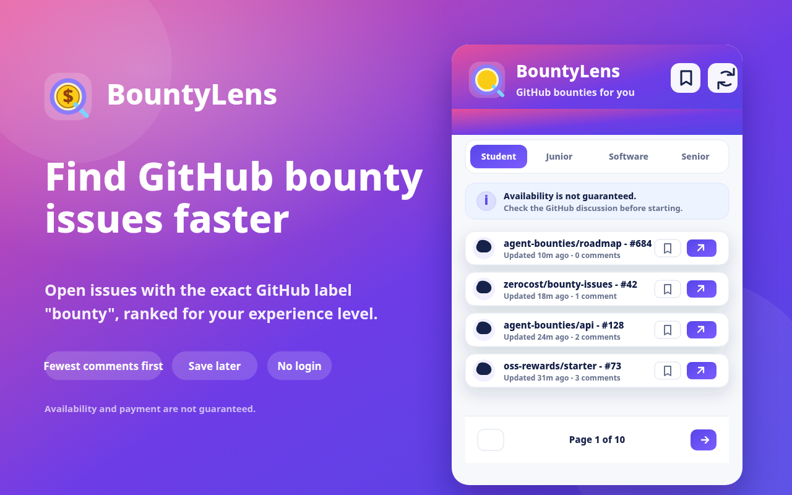

# BountyLens

[](https://github.com/rowenapinto001/BountyLens/actions/workflows/ci.yml)
[](LICENSE)
[](public/manifest.json)

Find GitHub bounties that match your experience.



BountyLens is a Chrome Manifest V3 side-panel extension that finds open public GitHub issues with the exact `bounty` label, estimates difficulty locally, ranks issues against the selected experience level and displays 10 issues per page.

It is built for developers who want a focused way to discover less-crowded bounty-labeled GitHub issues, save promising leads and open the original GitHub discussion without leaving the browser workflow.

## Status

- Version: `0.1.0`
- Release tag: `v0.1.0`
- License: MIT
- Bounty verification: exact GitHub label detection only. Availability and payment are not independently verified.

## Features

- First-run onboarding with one experience question.
- Public GitHub REST API search for `is:issue is:open label:bounty`.
- Exact case-insensitive `bounty` label validation.
- Pull request exclusion and malformed-result filtering.
- Local rule-based difficulty estimation without AI.
- Experience-based ranking for Student, Junior Developer, Software Engineer and Senior Engineer.
- Chrome side panel UI with refresh, experience tabs, saved bounties, theme toggle, pagination, loading, empty and error states.
- Local cache using `chrome.storage.local` with a 15-minute freshness window.
- Rate-limit, offline and GitHub failure handling.
- Issue buttons that open the original GitHub issue.
- Light and dark modes stored locally.
- Direct page-number pagination for faster navigation.

## Demo

The demo thumbnail above previews the BountyLens side-panel flow: experience selection, bounty-labeled issue discovery, save actions, GitHub links and numbered pagination. BountyLens detects the exact GitHub label `bounty`; availability and payment are not independently verified.

## Technology Stack

- Chrome Extension Manifest V3
- TypeScript
- React
- Vite
- Plain CSS
- Chrome Side Panel API
- GitHub REST API
- `chrome.storage.local`
- Lucide React icons
- Vitest

## Project Structure

```text
public/                 Extension manifest and icons
sidepanel/              Vite HTML entry for the side panel build
src/background/         Chrome service worker
src/sidepanel/          Side panel React entry and styles
src/components/         Reusable UI components
src/github/             GitHub API query, client and validation
src/ranking/            Difficulty and recommendation scoring
src/storage/            Chrome local storage helpers
src/hooks/              React data and storage hooks
src/utils/              Dates, labels, repository and pagination utilities
tests/                  Vitest utility tests
```

## Installation

```bash
npm install
```

## Development Commands

```bash
npm run dev
npm run typecheck
npm test
```

## Production Build

```bash
npm run build
```

The production extension is written to `dist/`.

## Load the Extension in Chrome

1. Run `npm run build`.
2. Open `chrome://extensions`.
3. Enable Developer mode.
4. Choose Load unpacked.
5. Select the `dist/` folder.
6. Click the BountyLens toolbar icon to open the side panel.

## GitHub API Rate Limits

BountyLens uses GitHub's free public unauthenticated REST API. This keeps setup simple and avoids tokens, but GitHub may limit repeated requests. When the limit is reached, BountyLens reads the public rate-limit headers and shows the reset time when available.

## Cache

Fetched issues are cached locally for 15 minutes. If the cache is fresh, BountyLens uses it without making another GitHub request. If cached results are older than 15 minutes, the extension shows them immediately while fetching fresh data. The Refresh button bypasses the cache.

## Privacy

BountyLens does not collect personal data. BountyLens does not use analytics. BountyLens does not sell user data. The selected experience, theme, saved bounties and cached public issues are stored locally in `chrome.storage.local`. GitHub issues are retrieved directly from GitHub's public API. No browsing history is read. No GitHub login is required.

## Current Limitations

- The MVP ranks the first 100 recently updated matching GitHub search results.
- It does not detect bounty amounts or currencies.
- It does not search external bounty platforms.
- It does not claim issues because GitHub has no universal issue-claiming mechanism.
- It does not authenticate with GitHub or access private repositories.
- Saved bounties are local to the browser profile.

## Repository Notes

- `node_modules/`, `dist/`, logs, coverage output and local environment files are ignored.
- Run `npm run build` before loading or refreshing the unpacked extension from `dist/`.
- Commit source files, tests, manifests, package files, README updates and icons; do not commit generated dependency or build folders.

## Contributing

Contributions are welcome. Read [CONTRIBUTING.md](CONTRIBUTING.md) before opening a pull request.

For security reports, read [SECURITY.md](SECURITY.md). Project changes are tracked in [CHANGELOG.md](CHANGELOG.md).

## License

BountyLens is available under the [MIT License](LICENSE).

## Future Ideas

- Optional additional GitHub search pages.
- Optional repository allowlist stored locally.
- More transparent scoring breakdown controls.
- Exportable shortlist stored locally.
